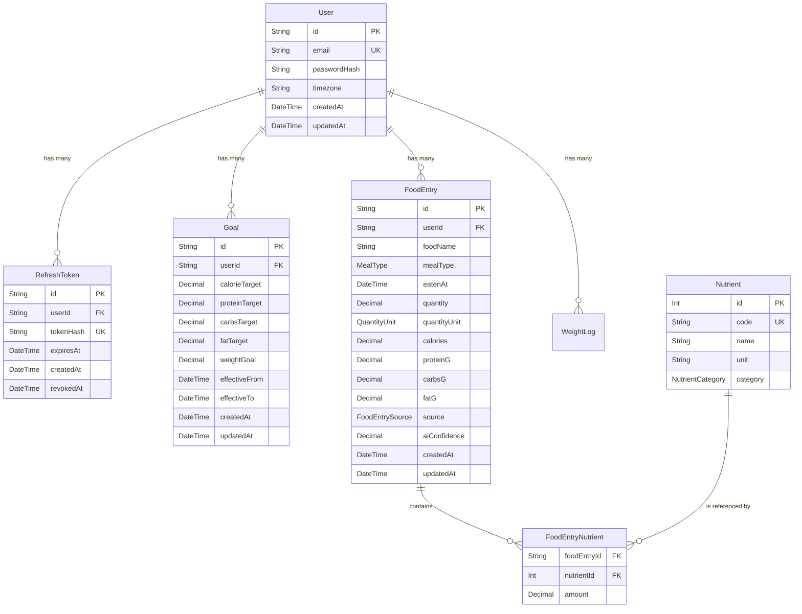

# Database Entity-Relationship Diagram

Here is the complete ER Diagram for the Personal Calorie Tracker database based on the Prisma schema.

### Enumerations Used
- **MealType**: `BREAKFAST`, `LUNCH`, `DINNER`, `SNACK`
- **QuantityUnit**: `GRAM`, `MILLILITER`, `PIECE`, `SERVING`
- **FoodEntrySource**: `MANUAL`, `AI_IMAGE`
- **NutrientCategory**: `VITAMIN`, `MINERAL`
